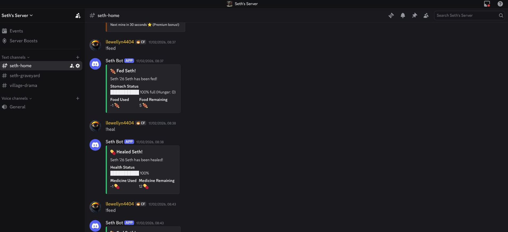
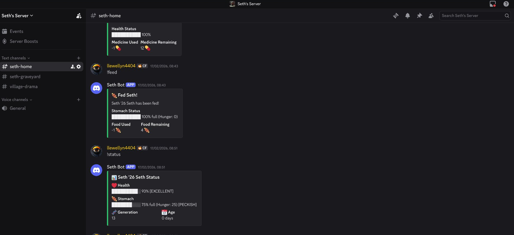
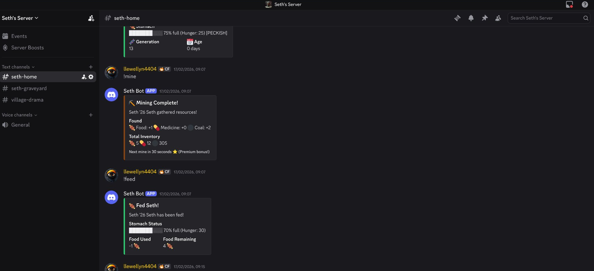
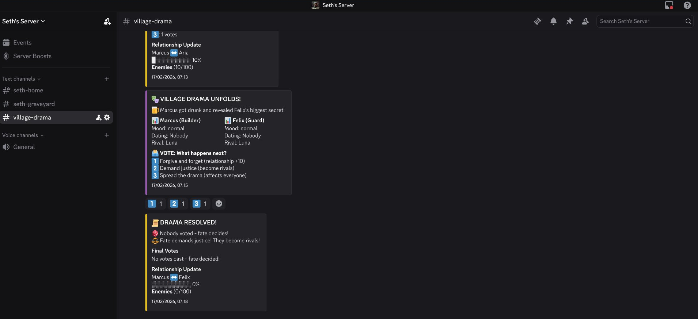
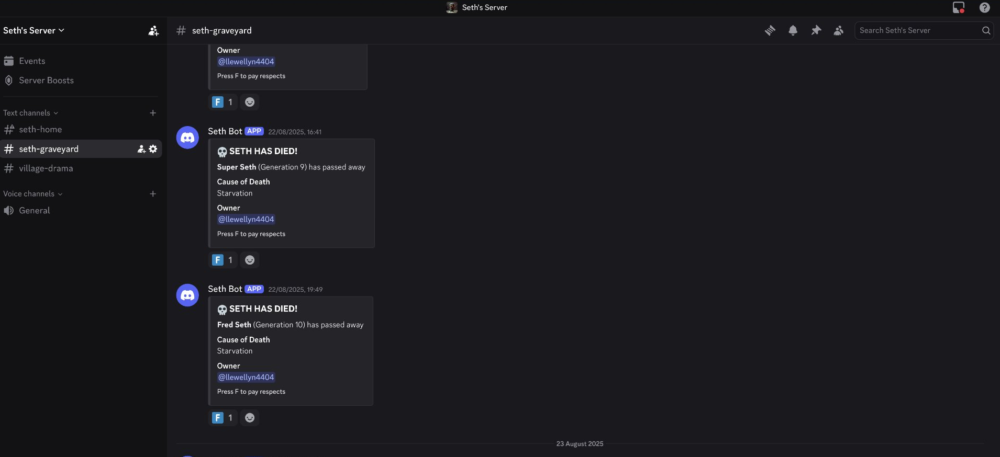

[](https://github.com/Bailie-L/seth-bot/actions/workflows/ci.yml)

# 🐣 Seth Bot

**A Discord Tamagotchi with Permanent Death**

Seth is a virtual pet Discord bot where death is *permanent*. No respawns. No second chances. When your Seth dies, it's gone forever—and you inherit a new generation carrying the weight of your failure.

[](https://python.org)
[](https://discordpy.readthedocs.io/)
[](LICENSE)


---

## 📸 Screenshots

### Caring for Your Seth


### Status Check & Mining


### Resource Gathering


### NPC Drama & Voting


### The Graveyard — Permanent Death


## 🎮 Features

### 💀 Permanent Death & Bloodlines
- **Death is forever** — No resurrection, no undo
- **Generational inheritance** — Each death spawns a new Seth (Gen 2, Gen 3...)
- **Public death announcements** — Everyone knows when you fail
- **Graveyard records** — Every Seth's legacy preserved

### 🍖 Survival Mechanics
- **Health & Hunger decay** — Your Seth deteriorates every 2 minutes
- **Resource management** — Mine for food, medicine, and coal
- **Feed and heal** — Use resources to keep your Seth alive
- **~50 minute lifespan** — Unfed Seths die in under an hour

### ⛏️ Economy System
- **Mining** — Gather resources with cooldowns
- **Trading** — Exchange resources with other players
- **Premium perks** — Faster mining for premium role holders
- **Inventory tracking** — Persistent resource storage

### 🎭 NPC Drama Engine
- **5 Village NPCs** — Luna, Marcus, Felix, Aria, and Thorne
- **Dynamic relationships** — NPCs form friendships, rivalries, and romances
- **Server-wide events** — Drama unfolds every 5 minutes
- **Player voting** — Your votes shape NPC destinies

### 📊 Social Features
- **Leaderboards** — Compete for longest-lived Seth
- **Server rankings** — See all Seths in your server
- **Compare stats** — Measure your Seth against others
- **Public shaming** — Death announcements with F reactions

---

## 📜 Commands

### Core Commands
| Command | Description |
|---------|-------------|
| `!start [name]` | Create your Seth (or inherit after death) |
| `!status` | View health, hunger, generation, and age |
| `!kill` | Instantly kill your Seth (testing) |

### Survival Commands
| Command | Description |
|---------|-------------|
| `!mine` | Gather food, medicine, coal (60s/30s cooldown) |
| `!feed` | Use 1 food → Reduce hunger by 30 |
| `!heal` | Use 1 medicine → Restore 25 health |
| `!inventory` | Check your resources |

### Social Commands
| Command | Description |
|---------|-------------|
| `!top` | Leaderboard of longest-lived Seths |
| `!server` | List all living Seths in server |
| `!compare @user` | Compare your Seth to another |
| `!trade @user [resource] [amount]` | Trade resources |

### Drama Commands
| Command | Description |
|---------|-------------|
| `!relationships` | View all NPC relationships |
| `!npc [name]` | View individual NPC details |
| `!help` | Full command documentation |

---

## ⚙️ How It Works

### Decay System
Every **2 minutes**, your Seth:
- Gains **+5 hunger**
- Loses **-1 health** (base decay)
- Loses **-1 additional health** if hunger ≥ 50
- Loses **-3 additional health** if hunger ≥ 80
- **Dies** at 0 health

### Health States
```
██████████ 100% [EXCELLENT]
████████░░  80% [GOOD]
██████░░░░  60% [FAIR]
████░░░░░░  40% [POOR]
██░░░░░░░░  20% [CRITICAL]
```

### Hunger States
```
0-20:   SATISFIED
21-40:  PECKISH
41-60:  HUNGRY
61-80:  STARVING
81-100: DESPERATE
```

---

## 🏗️ Project Structure

```
project_seth/
├── bot.py              # Main bot runner
├── config.py           # Configuration settings
├── database.py         # SQLite schema
├── cogs/
│   ├── seth_core.py    # Birth/death/status
│   ├── economy.py      # Mining system
│   ├── maintenance.py  # Feed/heal commands
│   ├── decay.py        # Automatic decay loop
│   ├── leaderboard.py  # Rankings
│   ├── public.py       # Server/compare features
│   ├── trading.py      # Resource trading
│   ├── drama.py        # NPC drama engine
│   └── help.py         # Documentation
└── utils/
    └── formatting.py   # Visual bar system
```

---

## 🚀 Self-Hosting

### Requirements
- Python 3.10+
- Discord Bot Token

### Installation

```bash
# Clone the repository
git clone https://github.com/Bailie-L/seth-bot.git
cd seth-bot

# Create virtual environment
python -m venv venv
source venv/bin/activate  # Linux/Mac
# OR: venv\Scripts\activate  # Windows

# Install dependencies
pip install -r requirements.txt

# Configure environment
cp .env.example .env
# Edit .env with your Discord token

# Run the bot
python bot.py
```

### Environment Variables
```
DISCORD_TOKEN=your_discord_bot_token_here
BOT_PREFIX=!
```

### Discord Setup
1. Create application at [Discord Developer Portal](https://discord.com/developers/applications)
2. Enable **MESSAGE CONTENT INTENT** under Bot settings
3. Invite with permissions: Send Messages, Embed Links, Add Reactions

---

## 📊 Technical Details

| Metric | Value |
|--------|-------|
| Lines of Code | ~3,000 |
| Feature Modules | 9 cogs |
| Database Tables | 8 |
| Commands | 20+ |
| Framework | discord.py 2.6.0 |
| Database | SQLite (aiosqlite) |

---

## 🎯 Recommended Server Channels

- `#seth-home` — Main gameplay
- `#seth-graveyard` — Death announcements
- `#village-drama` — NPC drama events

---

## 📝 License

MIT License — See [LICENSE](LICENSE) for details.

---

## 🤝 Contributing

Contributions welcome! This is a portfolio project demonstrating:
- Async Python programming
- Discord bot architecture
- SQLite database design
- Game loop mechanics
- Modular cog system

---

*Built with 💀 by [Bailie-L](https://github.com/Bailie-L)*

